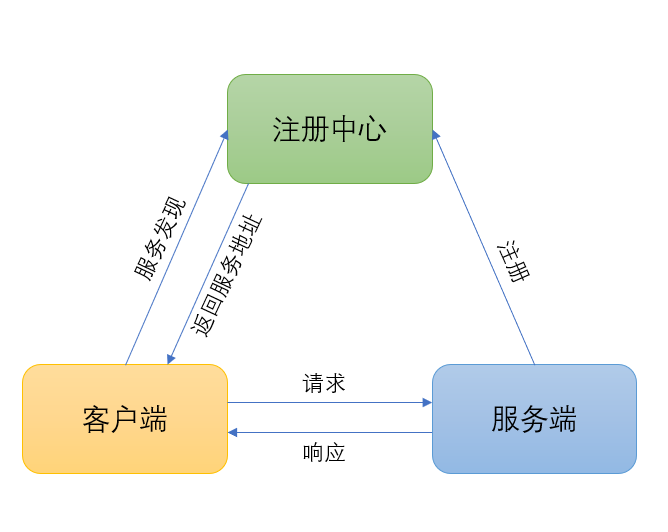
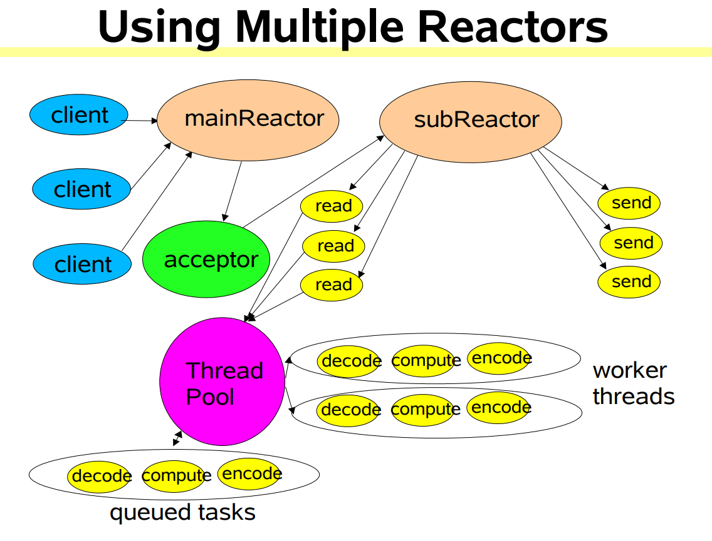

# simple-rpc

## 一:简介  

>最近在深入学习分布式RPC相关的知识,看了若干书籍和博客,流行框架源码. 纸上得来终觉浅，绝知此事要躬行. 于是写了这个简单的项目来加深理解. 从最开始的只有简单的客户端和服务端,逐渐加入注册中心,多线程,非阻塞IO,异步回调,Reactor模型,最后加入Netty,Spring,Zookeeper等第三方框架,一步步搭建一个简单的Rpc框架.项目的目录也对应着每个步骤.

## 二:各版本介绍  

>一个版本即一个目录

### 00: 简单版: 客户端和服务端

这一版只是简单的实现客户端远程调用服务端的服务. 使用Java原生的对象序列化反序列化请求和响应对象数据,实现编码和解码的目的.
### 01: 加入注册中心

  
如图所示,加入注册中心. 服务端注册服务地址到注册中心,客户端通过注册中心发现服务地址,然后发送请求到服务端.

### 02: 多线程,线程池

服务端添加线程池处理接收到的请求.

### 03: 非阻塞io

参考JAVA-NIO教程:http://tutorials.jenkov.com/java-nio/index.html. 服务端使用非阻塞io处理请求和响应. 使用NonBlocking-IO时,关键问题在于复杂的api使用和不完整的请求读取和不完整的响应写入的处理.

### 04: 异步回调  

加入支持异步回调请求结果的处理.

### 05: reator模型

参考java.util.concurrent包的作者，大师Doug Lea在《Scalable IO in Java》经典文章里分享的Reator模型.

如图所示,使用MainReactor接收请求,使用多个SubReactor负载均衡处理请求和响应相关数据的IO处理,使用线程池处理相关请求的业务计算处理.

### 06: 加入netty,Protostuff协议

Netty本质上也是采用Reator模型. Netty好在它对性能进行了优化,特别是数据的拷贝方面,Netty会预先申请内存,对内存进行精细管理,减少数据的拷贝.还有个有点是它简化了开发,特别是PipeLine模型极大简化了方便开发,解耦了代码.  
参考了以下项目:https://github.com/luxiaoxun/NettyRpc 和 https://gitee.com/huangyong/rpc

### 07: 加入spring
加入spring,使用IOC容器,方便服务的加载,注册,管理.

### 08: 加入zookeeper
使用zookeeper注册中心,管理服务的注册与发现.
注:运行测试代码时,需要开启zookeeper服务端.

## 三:to do
之后,还会对分布式RPC进行更深入的学习,学到新的知识,为了加深理解,可能也会添加到本项目中.
